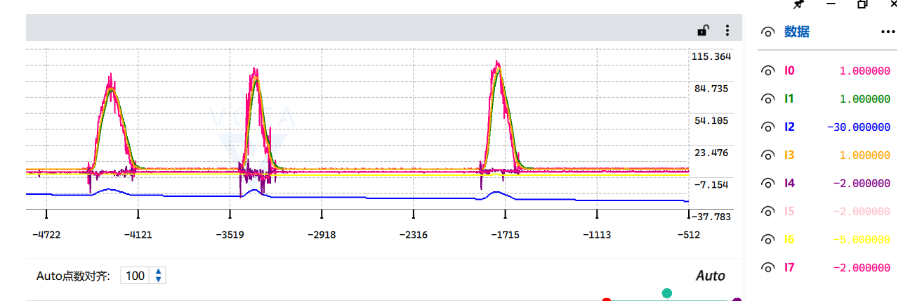
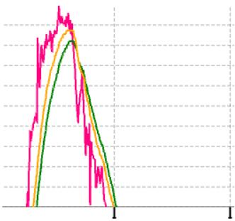

# IMU数据融合

使能I2C设备，读取MPU6050的角速度和加速度数据。

## kalman原理

使用卡尔曼滤波的变体，状态量为角度和角速度的偏移，输入为测出来的角速度，然后计算先验估计协方差矩阵和卡尔曼增益。最后根据卡尔曼增益计算当前状态，状态的第一个元素为角度。
### 步骤
- 状态变量X为角度和角速度偏移量
- 输入为测得的角速度
- 输出Z为角度
- 状态空间方程利用上次的角度和当前消除偏差后的角速度积分值，求出当前最佳的角度
- 根据上次的P，估计先验估计协方差P
- 更新卡尔曼增益K
- 更新先验协方差误差P

## 互补滤波

互补滤波是直接按照对应的比例融合角速度积分求出的角度结果和加速度atan求出的角度结果。这个比例在定期执行的情况下可以直接设为定值；如果非周期性调用，可以根据间隔时间实时调整比例，两次调用间隔时间长了，加速度计算的结果所占比例就应该更大一些。

## 实验
输出数据的代码如下：

```c
rt_kprintf("%3d, %3d, %3d, %3d, %3d, %3d, %3d, %3d\n", (int)roll, (int)kalAngleX, (int)gyroXangle, (int)compAngleX, (int)pitch, (int)kalAngleY, (int)gyroYangle, (int)compAngleY);
```

将mpu6050垂直九十度放置又迅速放下，波形如下图所示，除了陀螺仪角速度计算的角度值偏差较大，其余均正常跟随。可以看到陀螺仪计算结果产生了较大的漂移，可能是由于采样间隔时间较长产生了较大的累计误差。



再仔细放大波形观察，粉红色的加速度计算波形抖动较大，可能是因为旋转过程中加速度计算的存在误差。绿色的是卡尔曼滤波后的输出波形，波形平稳。橙色的是互补滤波器的计算结果，可以看见互补滤波的效果也非常好，响应相比于卡尔曼滤波的结果更快，计算量也比卡尔曼滤波小，因此我们平时最常用的就是互补滤波。

